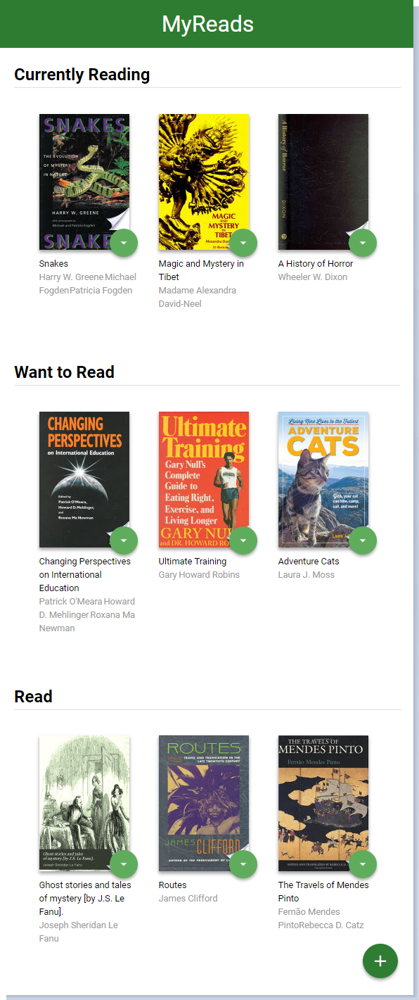

# MyReads Book Tracking App

## Description
>This is the 7th project for the Udacity [Front-End Web Dev Nanodegree](https://udacity.com/course/front-end-web-developer-nanodegree--nd001/ "Front-End Web Developer Nanodegree") as well as for the [React Fundamentals](https://www.udacity.com/course/react-nanodegree--nd019/ "React Developer Nanodegree") courses.

This Book Tracking App was built on top of Udacity's starter template, and our job was to create a virtual bookcase using [React](https://reactjs.org/ "Queen/King of Frameworks") by building the functionality, utilizing React components to manage the user interface, and mainly to be able to move books between shelves ('currently reading', 'want to read', and 'read'). The provided Books API makes it possible to search for books and add them to the appropriate bookshelf.

## Installation and Launch Instructions

  - Copy/clone repository from Github using Git:
```sh
$ git clone git@github.com:nyafologus/reactnd-project-myreads-starter.git
``` 
  - (or download it from [here](https://github.com/nyafologus/reactnd-project-myreads-starter/archive/master.zip "Download ZIP").)

  - Navigate into your project directory

  - Install dependencies with ```npm install``` or ```yarn install```

  - Start app server with ```npm start```

## Dependencies

This project was bootstrapped with [Create React App](https://github.com/facebookincubator/create-react-app). More information on how to perform common tasks can be found [here](https://github.com/facebookincubator/create-react-app/blob/master/packages/react-scripts/template/README.md).

### Preview



## Note on Search Terms

The backend API uses a fixed set of cached search results and is limited to a particular set of search terms, which can be found in [SEARCH_TERMS.md](SEARCH_TERMS.md). That list of terms are the _only_ terms that will work with the backend, so don't be surprised if your searches for Basket Weaving or Bubble Wrap don't come back with any results.